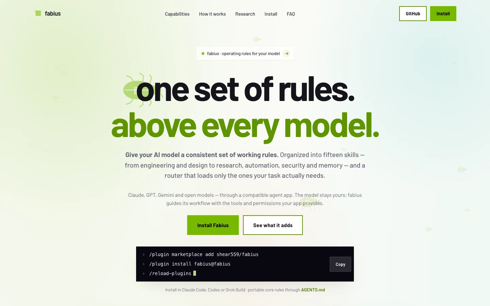

# fabius — landing page

The public site for **fabius — one set of rules above every model**.

[Website](https://fabius-landing.vercel.app) · [Rules repository](https://github.com/shear559/fabius) · [Whitepaper](fabius-as-a-system.pdf)



## Content baseline

Aligned with the **2.8.3** Fabius source. The page leads with “one set of rules above every model”, retaining the green palette, Barlow typography, system map and three capability outcomes. The previously removed skill-card grids, setup split and explainer video remain absent.

Fabius supplies instructions and workflows. The host supplies the model, tools and permissions. Model marks illustrate families; they do not establish tested integration or a universal quality gain.

| Public claim | Canonical Fabius source |
| --- | --- |
| Fifteen skills and capability ownership | `README.md`, `ARCHITECTURE.md`, `skills/*/SKILL.md` |
| Installation, updates and active-session loading | `README.md`, `skills/fabius/references/skill-frontmatter.md` |
| Twenty-two core rules, mathematical assumptions and heuristics | `RESEARCH.md`, `paper/proofs.json` |
| Historical gains, regressions and missing artifacts | `BENCHMARKS.md`, `evals/verify-receipts.mjs` |
| Local execution, provider processing and permission limits | `runtime/README.md`, `runtime/src/tools.mjs` |
| Content hashes, signed releases and timestamp status | `PROVENANCE.md`, `provenance/verify.sh` |

The reviewer example uses explicitly hypothetical probabilities. Its independence assumption and cost comparison are stated. Research curves are illustrative decision models, not measured performance. The page does not equate release checks with improved model quality.

## Structure and design

Static `index.html`, `styles.css` and `main.js`; no build or package installation. The page contains the hero, three capability outcomes, system/research explanations, installation tabs and thirteen FAQ entries. The FAQ and its JSON-LD must remain word-for-word equivalent.

The design uses the existing green tokens (`#76b900`, with darker text variants), self-hosted Barlow, square buttons and green-on-black system diagrams. The map has sixteen nodes: router, lean core, thirteen specialists and the shared reference spine. Its twenty-eight connectors are built from the specialist table in `main.js`. On narrow screens the map scrolls inside its own container. Reduced motion renders a static diagram.

## Local preview and verification

```sh
python3 -m http.server 8799
```

Serve from the repository root. Before publishing, check the actual page in a browser at phone, tablet and desktop widths, including WebKit. Exercise menu, keyboard tabs, copy buttons, FAQ parity, internal links, images, console and network failures. Inspect reduced motion and verify that the PDF bytes match the Fabius artifact manifest. Test production security headers as well; a plain local server does not supply them.

The September 8 accuracy pass verified the changed content locally in Chromium and WebKit. It did not establish that this batch was deployed. Production status must be checked separately after publication.

## Publication

The existing Vercel project is linked to `main`; pushing the website can publish it. Owner approval is required before pushing. Verify the deployed HTML, scripts, stylesheet, PDF hash, console and rendered page on the exact website URL above.

`vercel.json` supplies a same-origin CSP and restricts microphone, camera and geolocation. Keep executable scripts external. Files under `assets/` are cached immutably: use a new filename for a replaced image. Root CSS and JavaScript references carry dated version suffixes when those files change. The whitepaper is served at the root and must match the corresponding Fabius release.

Public source does not imply an open-source licence. Fabius is proprietary with a personal-use installation grant; its [licence](https://github.com/shear559/fabius/blob/main/LICENSE) states the terms.
