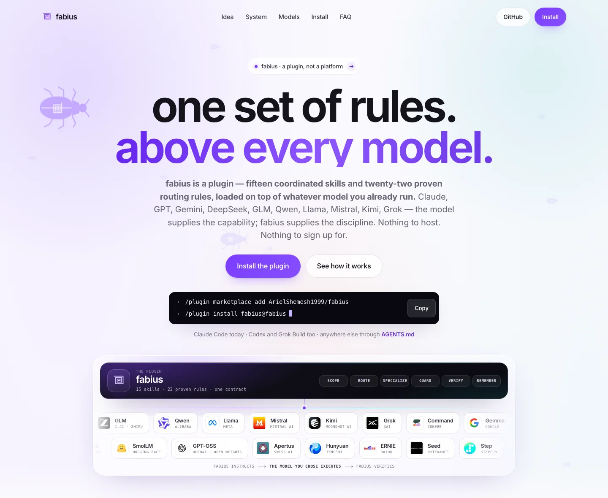

# fabius — landing page

> **The single-page marketing site for fabius — a plugin, not a platform: one set of operating rules above every model — for anyone deciding whether to install it.**

**Live:** [fabius-landing.vercel.app](https://fabius-landing.vercel.app)

  

The repo is the whole page: a 106 KB `index.html` (twelve `<section>` blocks, 24 inline SVG symbols, 15 of them per-skill beetles), a 67 KB `styles.css`, a 21 KB `main.js`, a self-hosted 48 KB Inter, 43 self-hosted official model/harness marks, and the 5 MB paper it serves. White canvas, one accent (`#7a3dff`). Its argument: the model is the engine, fabius is the rulebook — fifteen coordinated skills and twenty-two proven routing rules loaded on top of whatever model you already run (thirty-six families shown with their official marks), inside the harness you already use (Claude Code · Codex · Grok Build · any AGENTS.md reader). Nothing to host; no console of its own.

## Narrowing twelve sections to two exits

One `<h1>`, and two things to do at the end: install the plugin (GitHub) or read the paper — the only outbound links. The install block is a tabbed terminal (Claude Code · Codex · Grok Build · Anywhere) with one copy button per harness, and the hero carries the two Claude Code commands with a single copy. First paint costs ~200 KB of markup, CSS, JS, font and the hero marquee's 96 px WebP marks (the full-size marks in `assets/brands/` are the provenance source, never served); the 3.4 MB explainer waits behind a poster at `preload="metadata"`, and every image below the hero is lazy and sized.

## Building the system map in the browser, not shipping a picture

`main.js` builds `#sysmapSvg` from a thirteen-entry `LAYERS` table: 16 nodes — router → lean core → 13 specialist layers → the spine — joined by 28 connectors (26 beziers, two straight trunks). They draw in on `stroke-dashoffset`, staggered 28 ms apart, at a 0.2 IntersectionObserver threshold; 1.5 s later a packet dot loops every path via `animateMotion` + `mpath`, carrying both `href` and `xlink:href` for older WebKit. Under `prefers-reduced-motion` it settles into the finished drawing with no packets, never into nothing. On phones it keeps its 760 px width and scrolls inside `overflow-x:auto`, so the body never does.

## Making the motion cheap and fail-open

Scroll reveal has four ways to finish: an IntersectionObserver (`rootMargin: 0 0 -12%`, threshold `0.12`); a passive scroll probe 24 ms later, because WebKit can coalesce observer work during fast programmatic scrolls; a 350 ms sweep; and a 4.5 s catch-all. Reduced motion skips it, so nothing is hidden to begin with. The swarm is not in the HTML: `buildWalkers()` injects 17 hero and 9 dark-band walkers (9 and 5 on phones) inside `requestIdleCallback(…, { timeout: 700 })`.

## Serving it under a near-self-only CSP

`vercel.json` sets `default-src 'self'` — script, connect and font too, `object-src 'none'`, `frame-ancestors 'none'` — relaxed only for inline `style-src` and `data:` images, plus `nosniff` and CORS pinned to this origin. It fits: one deferred first-party script, no iframes, no analytics, every provider mark self-hosted and disclaimed in `assets/brands/README.md`. `Permissions-Policy` denies `microphone=()` — the page has no voice feature. `/assets/*` is `immutable` for a year, so a replaced mark needs a new name; the root files revalidate every load and still carry a dated `?v=`.

## Verifying on the deployed URL, not the local file

Releases run in headless Chrome at desktop and phone widths: zero console errors, zero horizontal overflow, correct DOM (16 nodes, 28 links), and a reduced-motion pass asserting the figures settle rather than vanish. The ten visible FAQ entries are generated from the same source as the ten `FAQPage` JSON-LD answers and diffed word-for-word — 10/10 on the deployed HTML, because a rich result that quotes the page differently is a lie with a schema wrapper. Probes then re-run against the live origin under production CSP: page, stylesheet, script, font, mp4 and PDF all 200, live `main.js` byte-identical to the repo.

## Stack

`Vanilla HTML/CSS/JS, no build` · `runtime-built inline SVG + SMIL` · `Vercel static + CSP headers` · `headless-Chrome verification`

Built by [@ArielShemesh1999](https://github.com/ArielShemesh1999). The fabius plugin is proprietary and provenance-sealed (public repo, personal-use install grant); this page is its public surface.
