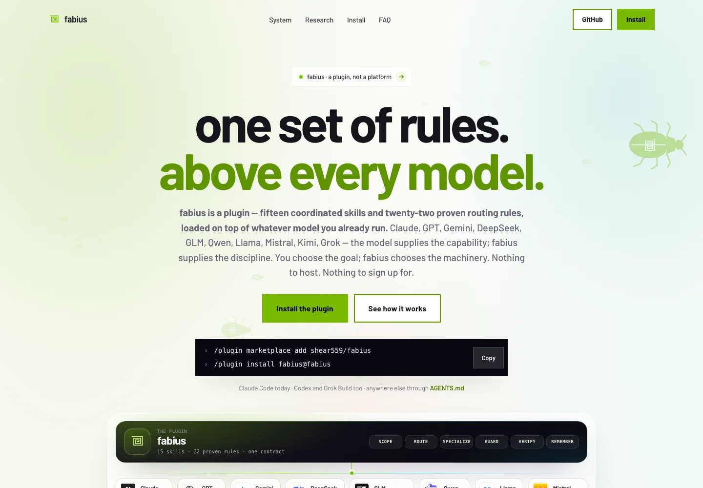
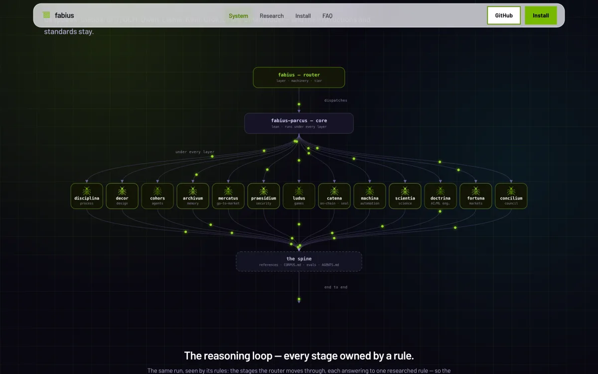
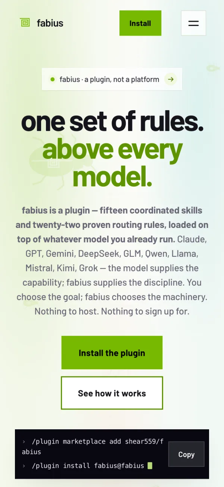

# fabius — landing page

> **The single-page marketing site for fabius — a plugin, not a platform: one set of operating rules above every model — for anyone deciding whether to install it.**

**Live:** [fabius-landing.vercel.app](https://fabius-landing.vercel.app) · **The plugin:** [github.com/shear559/fabius](https://github.com/shear559/fabius)

  

## Screenshots

  

  

The repo is the whole page: a 78 KB `index.html` (six `<section>` blocks, 16 inline SVG symbols, 13 of them per-specialist beetles), a 49 KB `styles.css`, an 18 KB `main.js`, self-hosted Barlow (400/500/600/700; 400 and 700 preloaded) with Inter as fallback, 43 self-hosted official model, provider and harness marks (35 appear in the hero marquee), and the 5 MB whitepaper it serves. Its argument is the plugin's contract: **you choose the goal; fabius chooses the machinery** — fifteen coordinated skills and twenty-two proven routing rules loaded on top of whatever model you already run (thirty-six families shown with their official marks), inside the harness you already use (Claude Code · Codex · Grok Build · any AGENTS.md reader). Nothing to host; no console of its own.

## One design system, two grounds

The light sections run the green system: one accent `#76b900` with an AA ramp (`#5e9400` for hover, large text and data ink at ≥3:1; `#4e7a00` for small text at ≥4.5:1), flat square buttons — green fill with black text, or a 2 px green outline — and liquid-glass surfaces (backdrop blur + a specular top edge) on the FAQ and the research card. The dark system band speaks the same language on black: green grid, green node strokes and packet dots, green rule badges and chart ink. Every color pair on the page passes WCAG AA for its role, including focus rings and chart data ink.

## Narrowing six sections to two exits

One `<h1>`, and two things to do at the end: install the plugin (GitHub) or read the paper — the only outbound links. The install block is a tabbed terminal (Claude Code · Codex · Grok Build · Anywhere) with one copy button per harness, and the hero carries the two Claude Code commands with a single copy. The whole page is ~220 KB over the wire — markup, CSS, JS, fonts and the hero marquee's 96 px WebP marks (the full-size marks in `assets/brands/` are the provenance source; only `gemini.svg` is served as-is, having no raster derivative). Those marquee ``s, each sized, are the page's only raster images — every figure below the hero is inline SVG.

## Building the system map in the browser, not shipping a picture

`main.js` builds `#sysmapSvg` from a thirteen-entry `LAYERS` table: 16 nodes — router → lean core → 13 specialist layers → the spine — joined by 28 connectors (26 beziers, two straight trunks). They draw in on `stroke-dashoffset`, staggered 28 ms apart, at a 0.2 IntersectionObserver threshold; 1.5 s later a packet dot loops every path via `animateMotion` + `mpath`, carrying both `href` and `xlink:href` for older WebKit. Under `prefers-reduced-motion` it settles into the finished drawing with no packets, never into nothing. On phones it keeps its 760 px width and scrolls inside `overflow-x:auto`, so the body never does.

## Making the motion cheap and fail-open

Scroll reveal has four ways to finish: an IntersectionObserver (`rootMargin: 0 0 -12%`, threshold `0.12`); a passive scroll probe 24 ms later, because WebKit can coalesce observer work during fast programmatic scrolls; a 350 ms sweep; and a 4.5 s catch-all. Reduced motion skips it, so nothing is hidden to begin with. The swarm is not in the HTML: `buildWalkers()` injects the hero and dark-band walkers (fewer on phones) inside `requestIdleCallback(…, { timeout: 700 })` — green beetles on the light ground, green on the dark.

## Serving it under a near-self-only CSP

`vercel.json` sets `default-src 'self'` — script, connect and font too, `object-src 'none'`, `frame-ancestors 'none'` — relaxed only for inline `style-src` and `data:` images, plus `nosniff` and CORS pinned to this origin. It fits: one deferred first-party script, no iframes, no analytics, every provider mark self-hosted and disclaimed in `assets/brands/README.md`. `Permissions-Policy` denies `microphone=()` — the page has no voice feature. `/assets/*` is `immutable` for a year, so a replaced mark needs a new name; the root files revalidate every load and still carry a dated `?v=`.

## Verifying on the deployed URL, not the local file

Releases run in headless Chrome at desktop and phone widths: zero console errors, zero horizontal overflow, correct DOM (16 nodes, 28 links), and a reduced-motion pass asserting the figures settle rather than vanish. The eleven visible FAQ entries are generated from the same source as the eleven `FAQPage` JSON-LD answers and diffed word-for-word — 11/11 on the deployed HTML, because a rich result that quotes the page differently is a lie with a schema wrapper. Probes then re-run against the live origin under production CSP: page, stylesheet, script, fonts and PDF all 200, live `main.js` byte-identical to the repo.

## Stack

`Vanilla HTML/CSS/JS, no build` · `runtime-built inline SVG + SMIL` · `Vercel static + CSP headers` · `headless-Chrome verification`

Built by [@shear559](https://github.com/shear559). The fabius plugin is proprietary and provenance-sealed (public repo, personal-use install grant); this page is its public surface.
