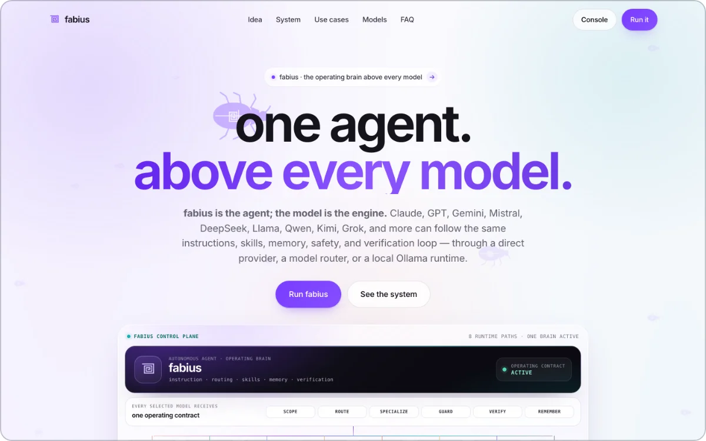

# fabius — landing page

> **The single-page marketing site for fabius — one autonomous agent layer above interchangeable model engines — for anyone deciding whether to hand it real work.**

**Live:** [fabius-landing.vercel.app](https://fabius-landing.vercel.app)

  

The repo is the whole page: a 90 KB `index.html` (fourteen `<section>` blocks, 24 inline SVG symbols, 15 of them per-skill beetles), an 80 KB `styles.css`, a 20 KB `main.js`, a self-hosted 48 KB Inter, and the 5 MB paper it serves. White canvas, one accent (`#7a3dff`). Its argument: the model is the engine, fabius supplies the operating brain — instruction, routing, skills, memory, verification — over eight implemented runtime paths (Anthropic, OpenAI, Google, Mistral, Groq, Hugging Face, OpenRouter, Ollama).

## Narrowing fourteen sections to two exits

One `<h1>`, and two things to do at the end: open the synapse console or read the paper — the only outbound links. First paint costs 233 KB of markup, CSS, JS and font; the 2.9 MB explainer waits behind a poster at `preload="metadata"`, and 26 of 34 images are lazy, all 34 sized.

## Building the system map in the browser, not shipping a picture

`main.js` builds `#sysmapSvg` from a thirteen-entry `LAYERS` table: 16 nodes — router → lean core → 13 specialist layers → the spine — joined by 28 connectors (26 beziers, two straight trunks). They draw in on `stroke-dashoffset`, staggered 28 ms apart, at a 0.2 IntersectionObserver threshold; 1.5 s later a packet dot loops every path via `animateMotion` + `mpath`, carrying both `href` and `xlink:href` for older WebKit. Under `prefers-reduced-motion` it settles into the finished drawing with no packets, never into nothing. On phones it keeps its 760 px width and scrolls inside `overflow-x:auto`, so the body never does.

## Making the motion cheap and fail-open

Scroll reveal has four ways to finish: an IntersectionObserver (`rootMargin: 0 0 -12%`, threshold `0.12`); a passive scroll probe 24 ms later, because WebKit can coalesce observer work during fast programmatic scrolls; a 350 ms sweep; and a 4.5 s catch-all. Reduced motion skips it, so nothing is hidden to begin with. The swarm is not in the HTML: `buildWalkers()` injects 17 hero and 9 dark-band walkers (9 and 5 on phones) inside `requestIdleCallback(…, { timeout: 700 })`.

## Serving it under a near-self-only CSP

`vercel.json` sets `default-src 'self'` — script, connect and font too, `object-src 'none'`, `frame-ancestors 'none'` — relaxed only for inline `style-src` and `data:` images, plus `nosniff` and CORS pinned to this origin. It fits: one deferred first-party script, no iframes, no analytics, every provider mark self-hosted and disclaimed in `assets/brands/README.md`. `Permissions-Policy` denies `microphone=()` though a section is about talking to the agent: the page describes voice, the console runs it. `/assets/*` is `immutable` for a year, so a replaced mark needs a new name; the root files revalidate every load and still carry a dated `?v=`.

## Verifying on the deployed URL, not the local file

Releases run in headless Chrome at desktop and phone widths: zero console errors, zero horizontal overflow, correct DOM (16 nodes, 28 links), and a reduced-motion pass asserting the figures settle rather than vanish. The nine visible FAQ entries are diffed word-for-word against the nine `FAQPage` JSON-LD answers — 9/9 on the deployed HTML, because a rich result that quotes the page differently is a lie with a schema wrapper. Probes then re-run against the live origin under production CSP: page, stylesheet, script, font, mp4 and PDF all 200, live `main.js` byte-identical to the repo.

## Stack

`Vanilla HTML/CSS/JS, no build` · `runtime-built inline SVG + SMIL` · `Vercel static + CSP headers` · `headless-Chrome verification`

Built by [@ArielShemesh1999](https://github.com/ArielShemesh1999). The fabius agent is private and provenance-sealed; this page is its public surface.
