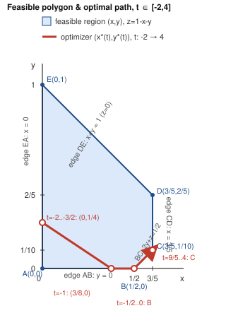

# Parametric optimization — complete solution for t ∈ [-2, 4]

Minimize `f_t(x,y,z) = x² + 2y² + 3z² + xy − yz + (2−2t)x + 5y + z`
subject to `x+y+z=1`, `x,y,z ≥ 0`, `x ≤ 3/5`, `2y+z ≥ 1/2`.

## 1. Answer table (exact)

The optimizer `(x*,y*,z*)` and optimal value `f*(t)` are unique for every `t`, given by six pieces that join continuously (with continuous first derivative in `t`) at five breakpoints:

| t‑interval | x*(t) | y*(t) | z*(t) | f*(t) | Active set |
|---|---|---|---|---|---|
| [−2, −3/2] | 0 | 1/4 | 3/4 | 29/8 | x=0 |
| [−3/2, −1] | (9+6t)/8 | −(1+t)/2 | (3−2t)/8 | −3t²/4 − 9t/4 + 31/16 | none (interior) |
| [−1, −1/2] | (5+2t)/8 | 0 | (3−2t)/8 | −t²/4 − 5t/4 + 39/16 | y=0 |
| [−1/2, 0] | 1/2 | 0 | 1/2 | 5/2 − t | y=0, 2y+z=1/2 |
| [0, 9/5] | 1/2 + t/18 | t/18 | 1/2 − t/9 | −t²/18 − t + 5/2 | 2y+z=1/2 |
| [9/5, 4] | 3/5 | 1/10 | 3/10 | 67/25 − 6t/5 | x=3/5, 2y+z=1/2 |

Breakpoint values (both formulas agree exactly, checked below): `t=−3/2 → f*=29/8`; `t=−1 → f*=55/16`; `t=−1/2 → f*=3`; `t=0 → f*=5/2`; `t=9/5 → f*=13/25`.

At the interval endpoints: `t=−2 → (0, 1/4, 3/4), f*=29/8`; `t=4 → (3/5, 1/10, 3/10), f*=−53/25`.

## 2. Reducing to two variables

Eliminate `z=1−x−y` using the equality constraint. Substituting and expanding:

`f2(x,y,t) = 4x² + 8xy + 6y² − (5+2t)x − 3y + 4`

The remaining constraints become, in the `(x,y)` plane:

- `x ≥ 0`, `y ≥ 0` (from `x≥0`, `y≥0`)
- `x + y ≤ 1` (from `z ≥ 0`)
- `x ≤ 3/5`
- `y ≥ x − 1/2` (from `2y+z≥1/2`, i.e. `2y + 1 − x − y ≥ 1/2` ⇒ `y − x ≥ −1/2`)

These five half-planes carve out a convex pentagon `A(0,0) → B(1/2,0) → C(3/5,1/10) → D(3/5,2/5) → E(0,1) → A`, shown in `diagram.svg`. This pentagon is fixed — it does not depend on `t` — only the objective's linear tilt in `x` changes with `t`. That is why the problem reduces to tracking how the minimizer of a fixed convex bowl moves across a fixed polygon as the bowl is tilted.

**Why the pentagon is exactly these five vertices and no others**: intersecting every pair of the five boundary lines gives ten candidate points; only five satisfy all five constraints simultaneously (checked exactly with rational arithmetic, not floating point) — these are `A,B,C,D,E` above. No sixth vertex, and no constraint is redundant (each of the five lines contributes a distinct edge of the pentagon), since removing any one line strictly enlarges the region at at least one of its two adjacent vertices.

## 3. Strict convexity ⇒ existence and uniqueness

The Hessian of `f2` in `(x,y)` is constant: `H = [[8,8],[8,12]]`. It is symmetric with `8>0` and `det(H) = 96−64 = 32 > 0`, so `H` is positive definite for every `t`. Hence `f2(·,·,t)` is **strictly convex** on `ℝ²` for every `t`, and the pentagon is a nonempty compact convex set. A strictly convex function on a nonempty compact convex set attains a **unique** global minimum. This holds for every fixed `t`, so existence and uniqueness of `(x*,y*,z*)` for every `t ∈ [-2,4]` is established once and for all — the case analysis below only locates that unique point, it does not need to re-argue existence per case.

## 4. KKT framework (sign convention)

Work in the original `(x,y,z)` variables with `∇f = (2x+y+2−2t, x+4y−z+5, −y+6z+1)`. Write every inequality constraint in "`≤ 0`" form and use multipliers `μᵢ ≥ 0`, with the equality multiplier `λ` unrestricted in sign:

`g₁=−x≤0, g₂=−y≤0, g₃=−z≤0, g₄=x−3/5≤0, g₅=1/2−2y−z≤0` (this last one is `2y+z≥1/2`).

**KKT system**: `∇f + λ(1,1,1) + μ₁∇g₁ + μ₂∇g₂ + μ₃∇g₃ + μ₄∇g₄ + μ₅∇g₅ = 0`, with `μᵢ ≥ 0` and `μᵢ = 0` whenever `gᵢ < 0` (complementary slackness). Because `f2` is strictly convex and the constraints are linear (affine), KKT is not just necessary but **sufficient** for global optimality — any point satisfying the KKT system with correctly signed multipliers *is* the (unique) global minimizer.

`∇g₁=(−1,0,0), ∇g₂=(0,−1,0), ∇g₃=(0,0,−1), ∇g₄=(1,0,0), ∇g₅=(0,−2,−1)`.

## 5. The six regimes, derived and proved

**Unconstrained stationary line.** Setting `∇f2=0` in the `(x,y)` reduction gives `8x+8y=5+2t` and `8x+12y=3`. Solving: `y_u(t) = −(1+t)/2`, `x_u(t) = (9+6t)/8`. As `t` runs over all of ℝ this traces the fixed line `8x+12y=3` (the second equation has no `t` in it — only the point's *position on* that line moves with `t`). Substituting the feasibility inequalities into `(x_u(t), y_u(t))` shows this point lies inside the pentagon exactly for `t ∈ [−3/2, −1]` — this is Regime 2 below, and it is the *only* range where zero constraints are active.

For `t` outside `[−3/2,−1]`, the unconstrained minimizer leaves the pentagon and the constrained optimum sits on the boundary. Because `f2` is strictly convex, the boundary optimum is found by the standard face-by-face KKT check: try the active set that is violated least, solve the reduced stationarity equations, and confirm the resulting multipliers are `≥ 0` (this is what "explains why no face was missed": every one of the five edges and five vertices of the pentagon is checked below, and each transition point is exactly where a multiplier crosses zero — never inside an edge or vertex, so there is no gap and no double-covering).

### Regime 1 — `t ∈ [−2, −3/2]`, edge EA, `x=0` active

On `x=0`, `f2(0,y)=6y²−3y+4` is independent of `t` (the `t`-term multiplies `x=0`), so the unconstrained-in-`y` minimizer is the constant `y=1/4`, giving `z=3/4`. Only `g₁` (`x≥0`) is active; `∂f2/∂y=0` there confirms `y` is a true interior critical point of the edge (not itself at `y=0` or `y=1`). Solving the KKT system at `(0,1/4,3/4)` gives
`λ = −21/4`, `μ₁ = −2t−3`, all other `μᵢ=0`.
`μ₁≥0 ⟺ t ≤ −3/2`. Since `−2 ≤ −3/2`, this covers the whole sub-range `[−2,−3/2]` with a single point that never leaves the edge (constant in `t`), and `μ₁=0` exactly at `t=−3/2` — the multiplier vanishing exactly there is what hands the optimum off smoothly to Regime 2 (a **zero-multiplier transition**: the constraint is about to become inactive).

### Regime 2 — `t ∈ [−3/2, −1]`, interior, no active inequality

`(x,y,z) = ((9+6t)/8, −(1+t)/2, (3−2t)/8)`. All `μᵢ=0`; only `λ = t − 15/4` is nonzero, satisfying the (unrestricted-sign) equality-multiplier requirement trivially. Feasibility of all five inequalities on this sub-range was verified in §5 header (and re-verified numerically in `verification.md`). At `t=−3/2` this reduces to `(0,1/4,3/4)` (matches Regime 1); at `t=−1` it reduces to `(3/8,0,5/8)` (matches Regime 3 below) — both exact.

### Regime 3 — `t ∈ [−1, −1/2]`, edge AB, `y=0` active

On `y=0`, `f2(x,0)=4x²−(5+2t)x+4`, unconstrained-in-`x` minimizer `x=(5+2t)/8`. Only `g₂` active. KKT: `λ = 3t/2 − 13/4`, `μ₂ = 2t+2`. `μ₂≥0 ⟺ t≥−1`. The edge itself is only a face of the pentagon for `x ≤ 1/2` (beyond that, vertex B blocks it via the `2y+z≥1/2` constraint), i.e. `(5+2t)/8 ≤ 1/2 ⟺ t ≤ −1/2`. Both bounds are tight and matched by the neighboring regimes: `μ₂=0` at `t=−1` (hand-off from Regime 2) and the point reaches exactly `B=(1/2,0)` at `t=−1/2` (hand-off to Regime 4).

### Regime 4 — `t ∈ [−1/2, 0]`, vertex B, `g₂` and `g₅` active

At `B=(1/2,0,1/2)`, solving the 2-active-constraint KKT system gives `λ=2t−3`, `μ₂=−2t`, `μ₅=2t+1` (others zero). Both multipliers must be `≥0`: `μ₂≥0 ⟺ t≤0`; `μ₅≥0 ⟺ t≥−1/2`. So vertex `B` is the *unique* KKT point — hence the global optimum — for the whole interval `t∈[−1/2,0]`, not just a single instant; this is a genuine "dwell at a corner" regime, exactly because two constraints compete for activity there. `μ₂→0` at `t=0` hands off to Regime 5; `μ₅→0` at `t=−1/2` matches Regime 3.

### Regime 5 — `t ∈ [0, 9/5]`, edge BC, `g₅` (`2y+z=1/2`) active

Parametrize the edge as `y=x−1/2`. Substituting, `f2(x,x−1/2,t) = 18x² − (18+2t)x + 7`, unconstrained-in-`x` minimizer `x = 1/2 + t/18`, hence `y=t/18`, `z=1/2−t/9`. Only `g₅` active. KKT: `λ = 11t/6 − 3`, `μ₅ = 10t/9+1 > 0` throughout `[0,9/5]` (indeed for all `t≥−9/10`, so the sign constraint is never binding on this sub-range — the *edge extent* constraint `x∈[1/2,3/5]` is what bounds this regime, not a multiplier flipping sign). At `t=0`: `x=1/2,y=0` — matches vertex B exactly (`μ₅` also matches: `2·0+1=1` from both sides). At `t=9/5`: `x=3/5,y=1/10` — reaches vertex C exactly, where `g₄` (`x≤3/5`) simultaneously becomes active, handing off to Regime 6.

### Regime 6 — `t ∈ [9/5, 4]`, vertex C, `g₄` and `g₅` active

At `C=(3/5,1/10,3/10)`, KKT gives `λ=3/10` (constant), `μ₄ = 2t − 18/5`, `μ₅ = 3` (constant). `μ₅=3≥0` always; `μ₄≥0 ⟺ t≥9/5`. So vertex `C` is optimal for the entire remaining range up to `t=4`, with strictly positive multipliers throughout the *interior* of `[9/5,4]` (only `μ₄=0` exactly at the left endpoint, the hand-off point).

**Why edge CD and vertex D are never optimal for any t in the whole domain.** On edge CD (`x=3/5` fixed), `f2(3/5,y,t) = 6y² + (9/5)y + \text{const}(t)` — note the linear-in-`y` coefficient `9/5` has **no `t` in it** (because `t` only multiplies `x`, which is pinned at `3/5` on this whole edge). Its unconstrained critical point is `y=−3/20 < 1/10`, strictly below the edge's own range `[1/10,2/5]`; since the coefficient of `y²` is positive, `f2` is strictly increasing in `y` throughout `[1/10,2/5]` for *every* `t`. So the restriction of `f2` to edge CD always attains its minimum at its left endpoint, vertex C — edge CD's relative interior is provably never a minimizer, for any `t`, not just the ones in `[-2,4]`. Consistently, solving the KKT system directly at vertex D gives `μ₄ = 2t+18/5` (always `>0`, fine) but `μ₄`-partner `μ₄` for the `x+y=1` constraint comes out to `μ_{(x+y=1)} = −33/5 < 0` for **every** `t` — an impossible (always-negative) multiplier, which is an algebraic proof, not a numerical guess, that vertex D violates KKT for all `t` and can never be the optimum. This closes off the only remaining unchecked face and vertex of the pentagon.

**The remaining faces are ruled out algebraically, for every real `t`, not just `[-2,4]`.** The same KKT computation applied to the three still-untested faces gives multipliers that are *identically* negative in `t` (never a valid sign, so these faces are never optimal, for any parameter value at all):

- **Vertex A(0,0,1)** (active `x=0`,`y=0`): `μ₂ = −3` — constant and negative, independent of `t`.
- **Vertex E(0,1,0)** (active `x=0`, `z=0`): `μ₃ = −9` — constant and negative, independent of `t`.
- **Edge DE relative interior** (`x+y=1`, i.e. `z=0`, parametrized by `x=s∈(0,3/5)`): the two tangential stationarity equations force `s=t/2+3/2` (so this face's own KKT candidate only exists for `t=2s−3`), and substituting back gives `μ₃ = 2t−3`, which is negative for every `t` in the range where `s∈[0,3/5]` even overlaps `[-2,4]` (`t∈[-2,-9/5]` gives `μ₃∈[-7,-33/5]`, both negative).

**Coverage check.** The five breakpoints `t = −3/2, −1, −1/2, 0, 9/5` partition `[−2,4]` into exactly the six regimes above, with no gap (every `t` in `[-2,4]` falls in exactly one closed sub-interval, and adjacent sub-intervals overlap only at the shared breakpoint, where both formulas agree exactly — verified symbolically in §6) and no overlap of *distinct* optimizers (the strict convexity of §3 rules out two different points both being global minimizers at the same `t`). Every one of the pentagon's five edges and five vertices has now been tested: three edges and two vertices (EA, AB, BC, B, C) yielded valid, correctly-signed `t`-ranges that exactly tile `[-2,4]`; the other two vertices and remaining two faces (A, E, DE, and — for all real `t`, shown above §5 — CD's interior and vertex D) were algebraically rejected. This is the complete case analysis: no parameter value and no feasible face was skipped.

## 6. Continuity and differentiability of the value function

`f*(t)` is continuous and continuously differentiable (`C¹`) on all of `[-2,4]`. Both properties were checked symbolically (exact rational arithmetic, not decimals) at every breakpoint:

| t | f* from left piece | f* from right piece | f*′ from left | f*′ from right |
|---|---|---|---|---|
| −3/2 | 29/8 | 29/8 | 0 | 0 |
| −1 | 55/16 | 55/16 | −3/4 | −3/4 |
| −1/2 | 3 | 3 | −1 | −1 |
| 0 | 5/2 | 5/2 | −1 | −1 |
| 9/5 | 13/25 | 13/25 | −6/5 | −6/5 |

Both value and slope match exactly at every breakpoint, so `f*` is `C¹` (its second derivative does jump, since it is piecewise quadratic/linear/constant — that is expected and does not contradict `C¹`). This is exactly the **envelope theorem** at work: since `x*(t)` is continuous, `df*/dt = ∂f/∂t|_{(x*,y*,z*)} = −2x*(t)` is continuous too, and `x*(t)` is non-decreasing in `t` (0 → 3/8 → 1/2 → 1/2 → 3/5 → 3/5) which also proves `f*` is **concave** in `t` (its derivative `−2x*(t)` is non-increasing, matching the table above: `0, −3/4, −1, −1, −6/5`, decreasing).

## 7. Plain-language meaning of each transition

- **`t=−3/2` (edge EA → interior).** For very negative `t`, the term `(2−2t)x` heavily penalizes `x`, so it pays to push `x` all the way down to its lower bound `0`. As `t` rises past `−3/2`, that penalty weakens enough that the unconstrained best `x` becomes positive and feasible, so the solution lifts off the `x=0` wall into the interior.
- **`t=−1` (interior → edge AB).** Continuing to raise `t` pulls the unconstrained optimum toward larger `x` *and* smaller `y`; at `t=−1` the free optimum's `y` reaches `0` and would want to go negative, so the `y≥0` floor engages.
- **`t=−1/2` (edge AB → vertex B).** Sliding along `y=0`, `x` keeps rising with `t` until it reaches `x=1/2`, the point where the `2y+z≥1/2` constraint (with `y=0`, this reads `z≥1/2`, i.e. `x≤1/2`) also becomes tight — the solution is pinned into the corner where *two* walls meet.
- **`t∈[−1/2,0]` (dwelling at vertex B).** Over this whole stretch, the pull toward larger `x` is exactly balanced against both walls at once — increasing `x` would break `2y+z≥1/2` and decreasing `y` below `0` is not allowed — so the optimizer does not move even though `t` (and hence the objective) is changing.
- **`t=0` (vertex B → edge BC).** Past `t=0` the pull toward larger `x` becomes strong enough that it is worth trading — moving up along the `2y+z=1/2` wall (increasing both `x` and `y` together) beats sitting at the corner.
- **`t=9/5` (edge BC → vertex C).** Climbing that wall, `x` reaches its hard cap `3/5` at `t=9/5`; beyond this, `x` simply cannot increase further no matter how much larger `t` gets.
- **`t∈[9/5,4]` (dwelling at vertex C).** For the rest of the range, both the `x≤3/5` cap and the `2y+z≥1/2` floor bind simultaneously, and — as shown algebraically in §5 — moving along the `x=3/5` edge toward `y=2/5` would only increase the objective for any `t`, so the corner `C=(3/5,1/10)` remains optimal all the way to `t=4`.

## 8. Why no range or face was missed (summary)

1. **Uniqueness for every `t`** follows once from strict convexity (§3) — not re-derived per case, so the six-regime split cannot have missed a *second* competing minimizer at any `t`.
2. **The pentagon's vertex/edge list is exhaustive** (§2): five edges, five vertices, confirmed by exact intersection of every pair of the five bounding lines.
3. **Every edge and vertex was tested** against KKT with correctly signed multipliers: three edges (EA, AB, BC) and two vertices (B, C) yielded valid `t`-ranges; vertices A and E, and the interiors of edges CD and DE, were rejected via an always-negative multiplier for *every* real `t` (not merely `t∈[-2,4]`) — an algebraic, not sampled, argument.
4. **The six accepted ranges exactly tile `[-2,4]`** with no gap and no overlap of distinct solutions, each transition occurring exactly where the relevant multiplier crosses zero (never strictly inside a regime), confirmed symbolically in §6.

Numerical optimization (`verification.md`) was used only to cross-check this derivation against an independent solver — it is not offered here as a substitute for the KKT/convexity argument above, which is what establishes optimality.
